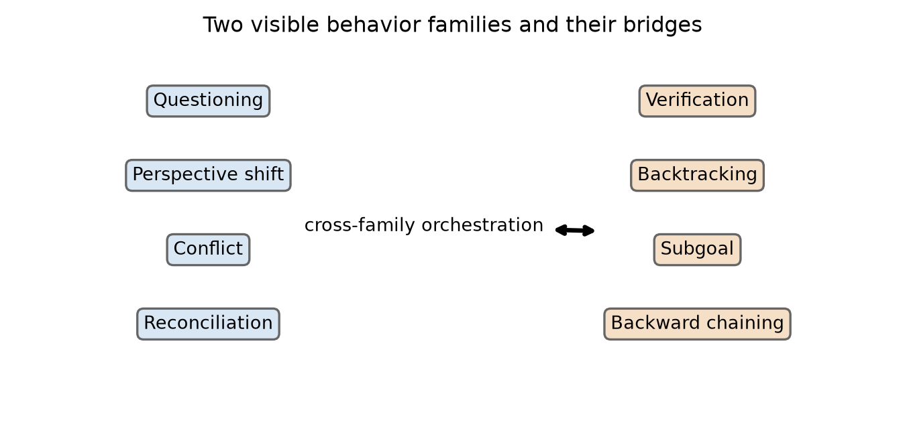
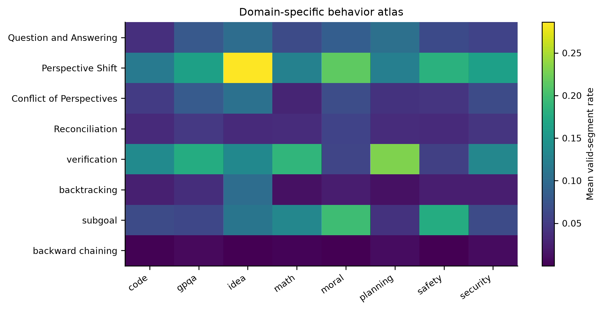
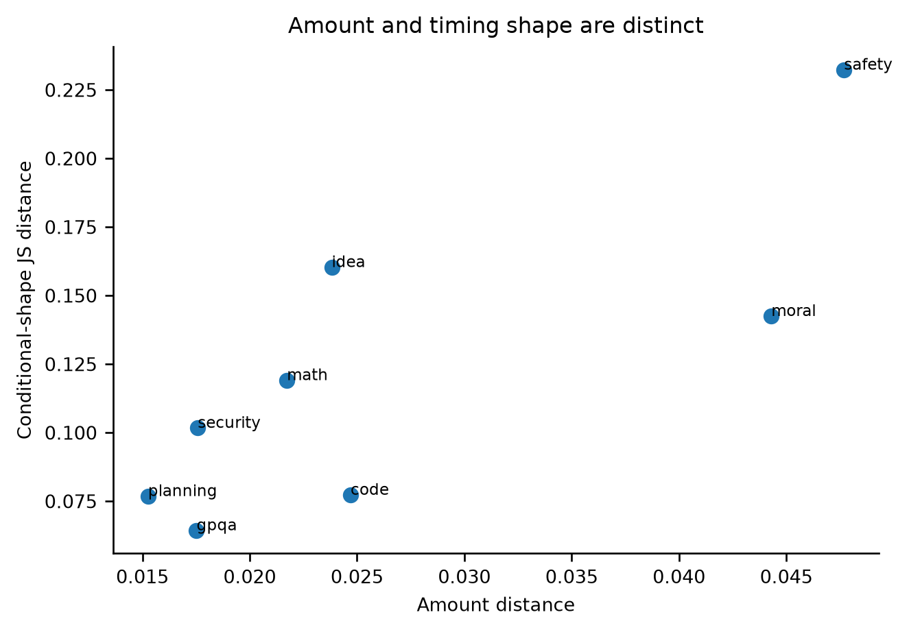
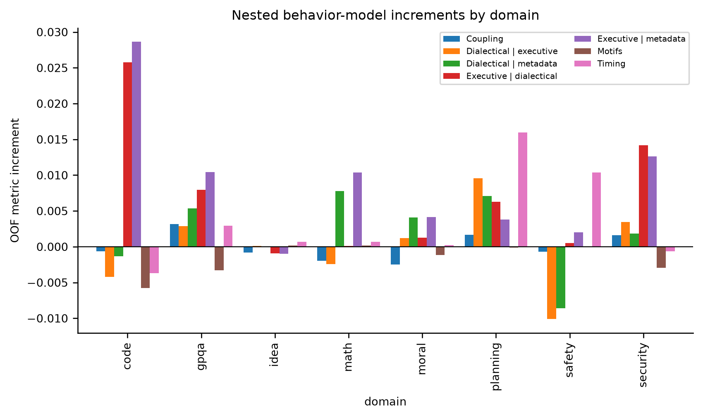
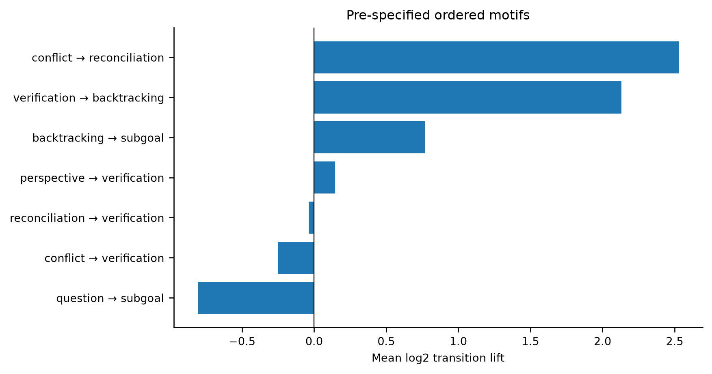
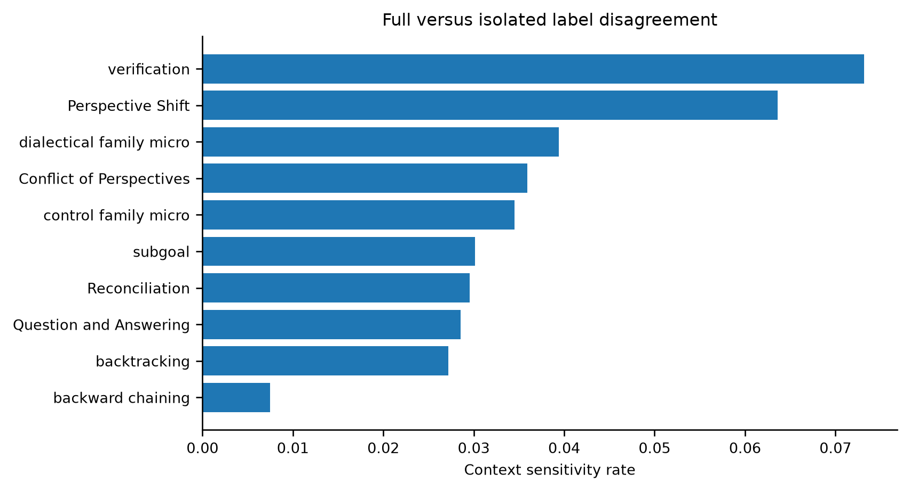
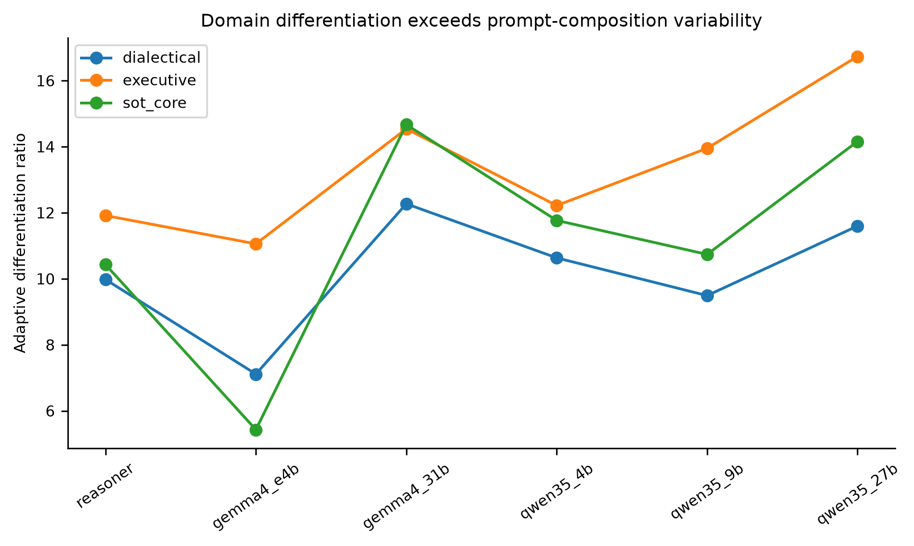
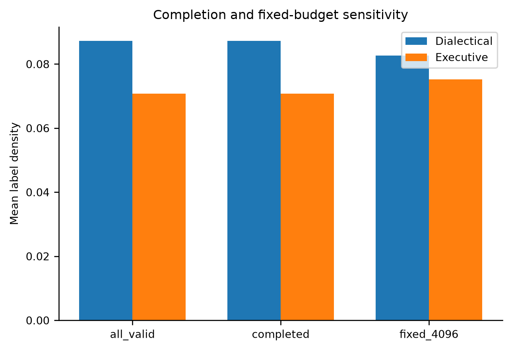
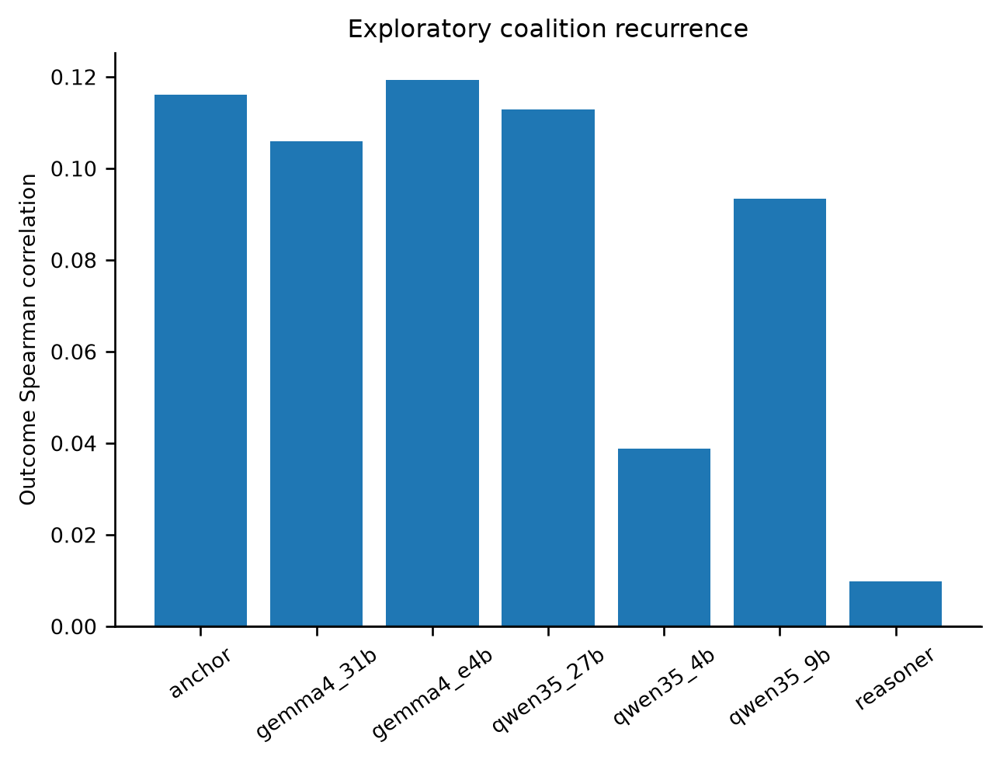

# Thought Atlas: final staged analysis report

**Config hash:** `cab9eef0f3432e440bbbbea9d2fa2cacd3295a718fdfa45b346676e4559f6838`  
**Code commit:** `90bad30c8a3e0a1e0860969bc84a133e99bd170a`  
**Analysis status:** Complete for RQ1–RQ9; RQ7 was tested under an explicitly exploratory gate.

## Executive result

The data support a moderate paper claim: visible deliberation is strongly organized by domain and model, and several relational operations require trajectory context to label consistently. Pairwise localization shows which domains differ, and exact held-out attribution identifies which operations carry those distinctions. The data do **not** support the stronger claim that a textual signature generally predicts better native outcomes: two dichotomized high/low sensitivity cells appear, but none survive the stricter native-outcome specification.

## Methods in plain language

We first audited exact trace/segment keys and outcome directions. Behavior amounts use valid segments only; conditional shapes ask *when a behavior occurs*, separately from *how much it occurs*. All signature runs use the frozen five-fold prompt registry and training-fold-only preprocessing. Pairwise domain models test all 28 domain pairs; exact four-group Shapley decomposition fits all 16 behavior subsets. Native-outcome models stay within model and domain, retain continuous outcomes, and add available prompt stratum to both length controls. Uncertainty uses prompt composition resampling; it is not decoding variance.

## Exact regression and Shapley calculation

For each held-out fold, predictor j is standardized using only the other folds: z_ij = (x_ij - mean_train,j) / sd_train,j. Missing values receive the training mean. The test prompt cannot influence its own imputation values, scales, or fitted coefficients. Prompt-stratum dummy columns are fixed from prompt metadata before cross-validation and contain no outcomes.

For categorical targets, class c receives score eta_ic = alpha_c + z_i^T beta_c and probability p_ic = exp(eta_ic) / sum_r exp(eta_ir). The fit minimizes -sum_i log p_i,true + (1/2) sum_c ||beta_c||^2. For continuous native outcomes, yhat_i = alpha + z_i^T beta and the fit minimizes sum_i(y_i-yhat_i)^2 + ||beta||^2. In both cases lambda = 1 and intercepts are not penalized. This is standard ridge regression: it stabilizes correlated behavior features while retaining a transparent linear model.

Behavior amount is positive valid segments divided by all valid segments. Within each early/middle/late phase, phase prevalence is positive segments divided by valid segments in that phase; the three prevalences are normalized within behavior. Timing uses middle-minus-early and late-minus-early normalized shares. Amount is tested beyond log token and valid-segment counts. Timing is tested beyond length plus all four amount rates, so timing cannot win merely because the behavior occurs more often.

For nested categorical models A and B, trace i contributes g_i(B|A) = log2[p_B(true class) / p_A(true class)]. The mean is bits per held-out trace; 2 raised to that mean is the geometric-mean multiplier in probability assigned to the true class. For a continuous outcome, g_i(B|A) = [(y_i-yhat_A)^2 - (y_i-yhat_B)^2] / Var(y), whose mean is exactly R2_B - R2_A.

Shapley then divides this held-out gain among the four behaviors in one family. We fit all 2^4 = 16 behavior subsets on the same folds. For behavior b, phi_ib is the weighted sum over every subset S not containing b of [v_i(S plus b) - v_i(S)], with weight |S|!(4-|S|-1)!/4!. The weight is simply the fraction of all addition orders in which S comes immediately before b. Consequently, the four behavior contributions add exactly to the full-versus-base held-out gain for each trace, up to floating-point precision.

This is why we use Shapley rather than coefficient magnitude: coefficients change with scaling, reference coding, and correlated predictors, whereas Shapley allocates the actual out-of-fold score improvement. Dot area in Figures 14–15 is this predictive credit. Color is deliberately separate: blue/orange comes from a one-domain-versus-rest contrast and says more versus less, or later versus earlier. The x-axis boxes distinguish conversational Q/P/C/R from cognitive V/B/S/K. A ring appears only when the 95% paired-bootstrap lower bound is positive and the Benjamini–Hochberg q value is below .05.

## RQ1 — Are the two families distinguishable?

**Verdict: partially supported.** The prespecified 4+4 partition is not cleanly separated by profile similarity, although the families differ descriptively by domain and context.

Key result: Prespecified separation = -0.016 (95% CI -0.051 to 0.018); exact balanced-partition p = 0.514.

Main caveat: The separation CI crosses zero and the exact balanced-partition p-value is about 0.51.

## RQ2 — How do domain and model change organization?

**Verdict: supported.** Domain and model change both behavior amount and conditional timing shape.

Key result: The analysis retained 18,624 reasoning traces and all 48 model-by-domain cells.

Main caveat: Bootstrap shape CIs use 200 resamples; one seed per prompt.

## RQ3 — Are dialectical behaviors sufficient?

**Verdict: not supported.** Behavior families describe outcomes unevenly; cross-family coupling adds little on average beyond amounts and timing.

Key result: Mean held-out increment from coupling = -0.0000; from motifs = -0.0016.

Main caveat: Associational prediction; continuous open-ended outcomes retained.

## RQ4 — Do motifs generalize?

**Verdict: partially supported.** Pre-specified motifs are structurally enriched, but their average held-out outcome increment is weak.

Key result: Mean held-out motif increment = -0.0016.

Main caveat: 1,000 Monte Carlo count-null draws approximate the two specified shuffles; label-level permutation was computationally deferred and is not used as confirmation.

## RQ5 — Which labels require context?

**Verdict: supported.** Several process labels are trajectory-relative and change under isolated scoring.

Key result: Full-versus-isolated disagreement = 3.9% for dialectical labels and 3.5% for executive labels.

Main caveat: Same production judge in both modes; disagreement is not validity.

## RQ6 — Is capability linked to adaptive differentiation?

**Verdict: partially supported.** All reasoning models differentiate domains beyond prompt-composition variability, but a universal capability/scale relationship is not established.

Key result: Adaptive-differentiation ratios range from 5.43 to 16.74.

Main caveat: Within-domain variability is prompt composition, not decoding variance; Qwen and Gemma scale patterns differ.

## RQ7 — K-line-inspired recurrence

**Verdict: not supported.** The K-line-inspired interpretation gate does not pass.

Key result: Mean recurrence–outcome Spearman correlation = 0.085; the full gate failed because only 2 of 5 required criteria passed.

Main caveat: Visible coalition recurrence is not memory retrieval.

## RQ8 — Do signatures differ across domains within a fixed model?

**Verdict: supported.** Within every reasoning model, both signature families distinguish held-out domains; localization supports amount differences in 294 of 336 domain-pair cells and identifies the behaviors carrying that signal.

Key result: Amount is supported in 12/12 omnibus model-family tests and 294/336 pairwise cells; timing is supported in 94 pairwise cells.

Main caveat: Pairwise and Shapley results allocate predictive information; they are not causal or latent-cognition claims.

## RQ9 — Do signatures differ by attempt quality?

**Verdict: partially supported.** A high-versus-low sensitivity finds 2 cells, but the stricter native-outcome specification supports 0 amount and 0 timing cells.

Key result: The common-scale high/low sensitivity supports amount in 2 cells, but the native-outcome analysis supports amount in 0 and timing in 0 of 88 estimable cells.

Main caveat: The sensitivity findings are not confirmed with native outcomes; only 45 incomplete traces have usable labels.

## Figures












## Null results and boundaries

- Average cross-family coupling and motif increments are small; do not claim a universal orchestration benefit.
- Qwen and Gemma do not justify one universal scaling law.
- Safety prefix timing is not a general deployable warning signal.
- No amount or timing block survives correction in the native-outcome within-model/domain analysis; the two high/low sensitivity cells are not confirmatory.
- Behavior Shapley values allocate held-out predictive information and do not establish that a behavior causes a domain difference or a better answer.
- Incomplete attempts cannot be modeled because their sentence-level label coverage is too sparse.
- The anchor comparison is answer-text/4,096-token versus think-text/65,536-token and is not a causal training contrast.
- K-line language remains exploratory and cannot identify a memory mechanism.

## Regression specification log

The exact estimands, baselines, feature ladders, correction families, earlier RQ3 M0–M5 models, and new RQ8a/RQ8b/RQ9a runs are recorded in `REGRESSION_MODEL_LOG.md` and `data/v2/analysis/paper/09_signatures/model_run_log.json`.

## Appendix: specification deviations and unavailable validation

- Conditional-shape intervals use 200 prompt-composition bootstrap resamples, not the planned 1,000; the single decoding seed prevents generation-variance inference.
- Motif nulls use 1,000 Monte Carlo count-level approximations. Exact label-level circular-shift and within-decile shuffles were not feasible and are not treated as confirmatory evidence.
- Family portability is a held-out-family diagnostic over prompt-disjoint predictions, not a separate train-on-family/test-on-family refit.
- The context-validation package contains a reproducible metadata-only sample manifest. No independent human or cross-judge labels were available, so disagreement measures sensitivity, not validity.

## Appendix: accepted release exceptions

The owner approved four non-repairable exceptions: 13 invalid extractions, 1,622 clipped extractor prompts, one consumer-contract rejection, and 673 Track-B parse-failure rows. Invalid outcomes remain null; invalid labels are excluded from denominators. Any new audit issue still blocks.

## Exact commands

```bash
.venv/bin/python scripts/run_paper_analysis.py --config configs/paper_analysis.yaml --stage all --force --jobs 1
.venv/bin/python scripts/run_signature_analysis.py --config configs/paper_analysis.yaml --force
.venv/bin/python -m pytest tests/ -q
```

## Finding registry

| finding_id | research_question | claim | status | estimate | main_caveat |
| --- | --- | --- | --- | --- | --- |
| RQ1_FAMILY | RQ1 | The prespecified 4+4 partition is not cleanly separated by profile similarity, although the families differ descriptively by domain and context. | partially_supported | -0.016277035847857682 | The separation CI crosses zero and the exact balanced-partition p-value is about 0.51. |
| RQ2_DOMAIN | RQ2 | Domain and model change both behavior amount and conditional timing shape. | supported | 18624.0 | Bootstrap shape CIs use 200 resamples; one seed per prompt. |
| RQ3_OUTCOME | RQ3 | Behavior families describe outcomes unevenly; cross-family coupling adds little on average beyond amounts and timing. | not_supported | -2.1391293693315272e-05 | Associational prediction; continuous open-ended outcomes retained. |
| RQ4_MOTIFS | RQ4 | Pre-specified motifs are structurally enriched, but their average held-out outcome increment is weak. | partially_supported | -0.00160587743008272 | 1,000 Monte Carlo count-null draws approximate the two specified shuffles; label-level permutation was computationally deferred and is not used as confirmation. |
| RQ5_CONTEXT | RQ5 | Several process labels are trajectory-relative and change under isolated scoring. | supported | 0.0394055905355685 | Same production judge in both modes; disagreement is not validity. |
| RQ6_ADAPT | RQ6 | All reasoning models differentiate domains beyond prompt-composition variability, but a universal capability/scale relationship is not established. | partially_supported | 5.43192338404244 | Within-domain variability is prompt composition, not decoding variance; Qwen and Gemma scale patterns differ. |
| RQ7_KLINE | RQ7 | The K-line-inspired interpretation gate does not pass. | not_supported | 0.08543367234572245 | Visible coalition recurrence is not memory retrieval. |
| RQ8_DOMAIN_SIGNATURE | RQ8 | Within every reasoning model, both signature families distinguish held-out domains; localization supports amount differences in 294 of 336 domain-pair cells and identifies the behaviors carrying that signal. | supported | 0.756267979746989 | Pairwise and Shapley results allocate predictive information; they are not causal or latent-cognition claims. |
| RQ9_QUALITY_SIGNATURE | RQ9 | A high-versus-low sensitivity finds 2 cells, but the stricter native-outcome specification supports 0 amount and 0 timing cells. | partially_supported | 0.002608597578997638 | The sensitivity findings are not confirmed with native outcomes; only 45 incomplete traces have usable labels. |
