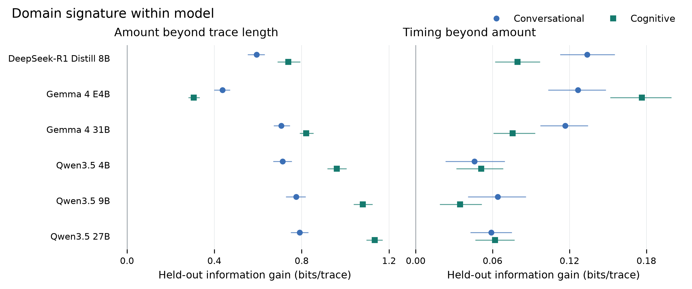
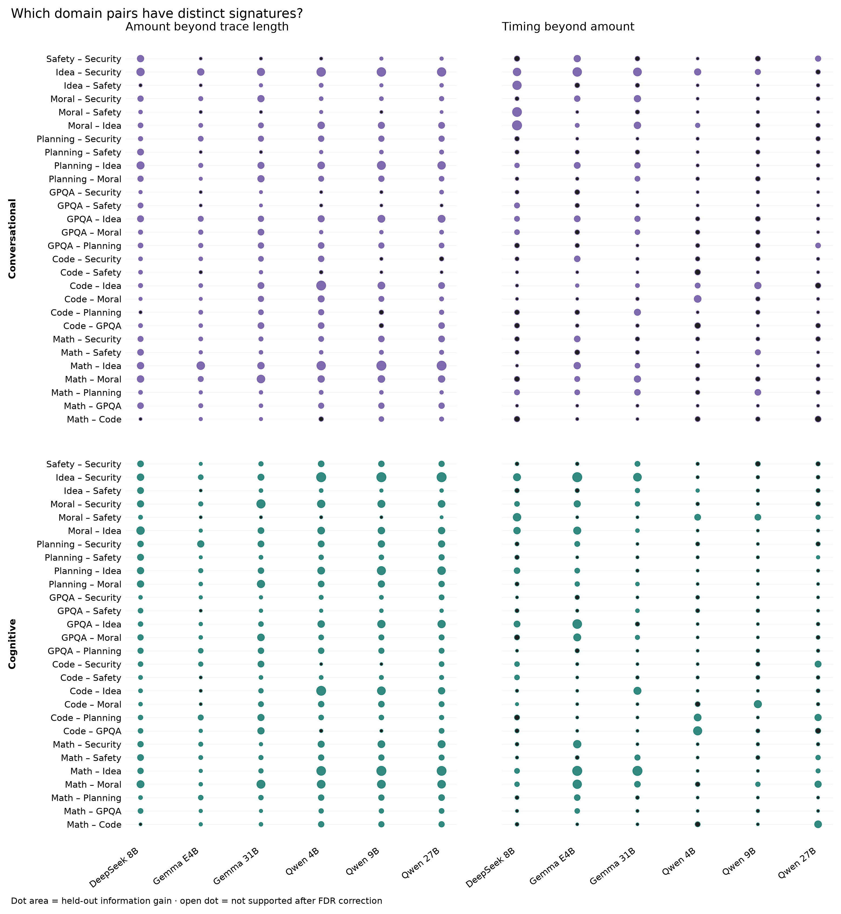
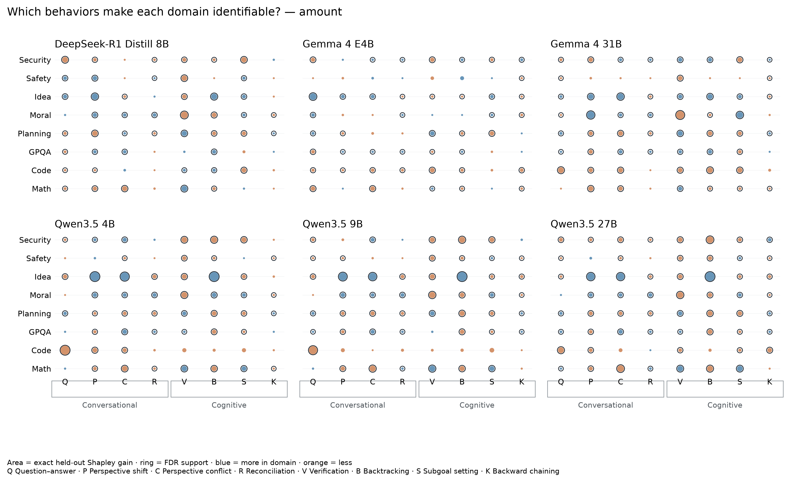
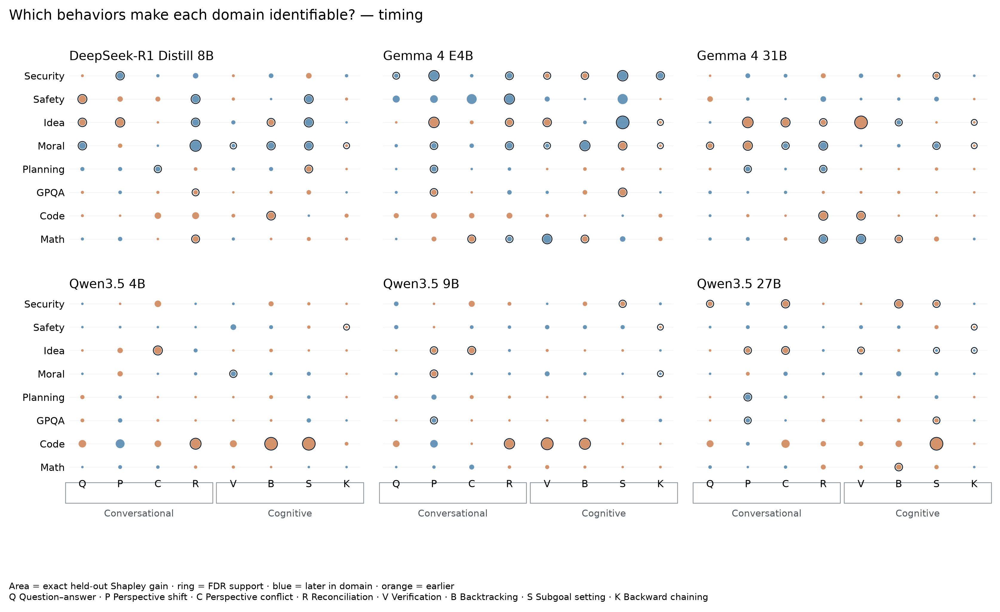
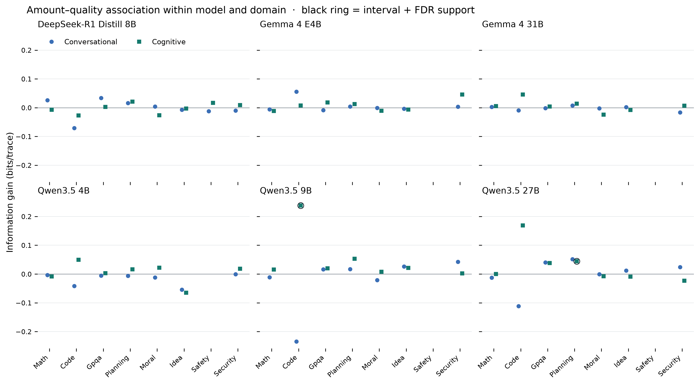
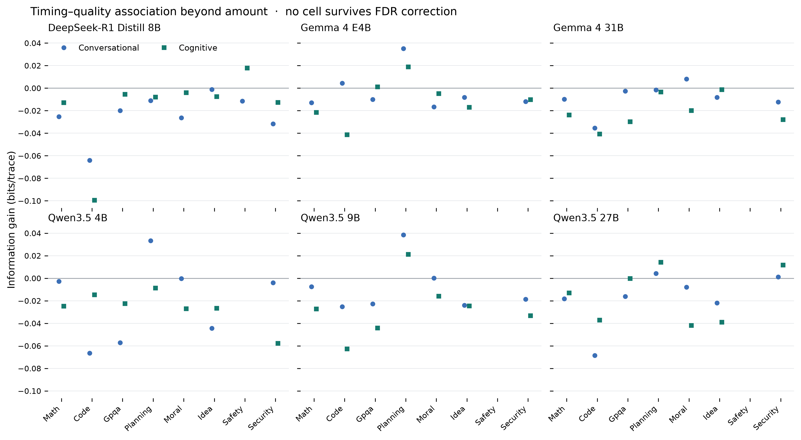
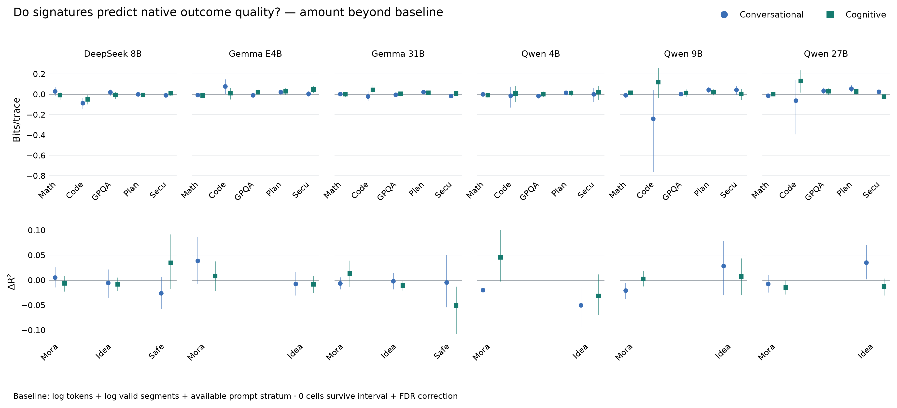
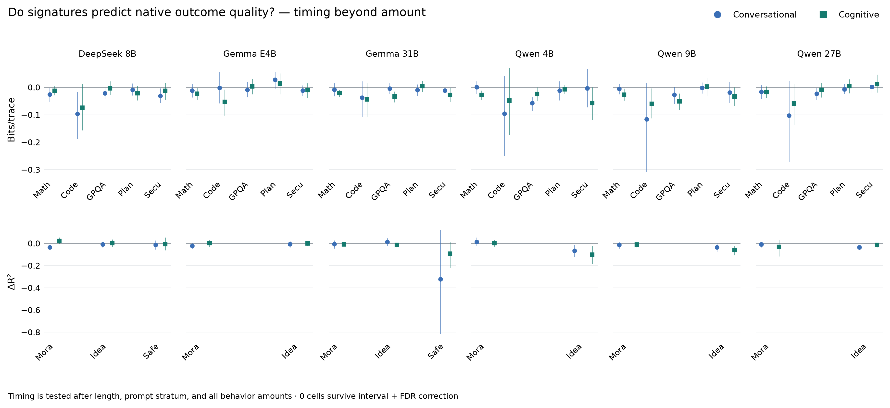
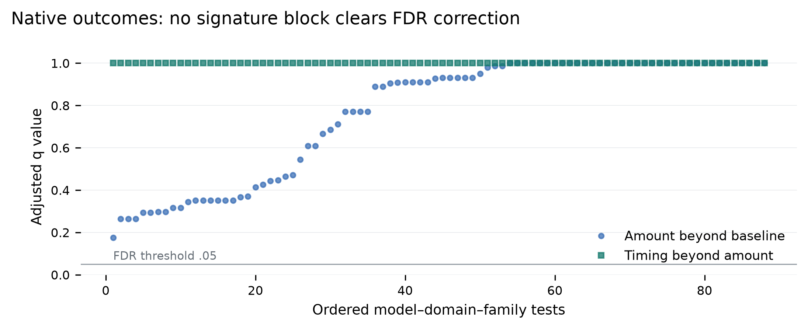

# Thought Atlas: conversational and cognitive signatures

## Why these analyses

A domain signature is useful only if it distinguishes held-out prompts within the same model. We therefore predict domain separately for each model, rather than treating model identity as evidence of a domain effect. We then ask whether timing improves prediction after behavior amount is already known.

For attempt quality, the same logic is applied within each model and domain. This prevents a model's overall capability or a domain's base rate from masquerading as a process signature.

## RQ8 — Do conversational and cognitive signatures differ across domains within a fixed model?

**Yes for both families in every reasoning model.** Amount improves held-out domain identification in 12 of 12 model-family tests. Conditional timing adds further information in 12 of 12 tests after false-discovery correction.

The strongest amount signal is cognitive behavior in Qwen3.5 27B: 1.134 bits per held-out trace beyond trace length. Across all cells, the median timing increment is 0.070 bits. Thus timing is not merely decorative, but amount carries the larger share of the domain signal.

Cognitive amount is more domain-distinctive than conversational amount in 5 of 6 models. The modal paths make the difference concrete: verification is the final dominant cognitive operation in math for all six models; backtracking appears in the idea-domain cognitive path for five; moral traces begin with subgoal setting in all six. Conversational paths are less varied in identity—perspective shift usually dominates—but Qwen math and planning traces often move toward question–answer behavior later.



## RQ8a — Which particular domains differ?

The omnibus result is localized with all 28 domain pairs, separately for every model and signature family. Amount is interval- and FDR-supported in 294 of 336 pairwise cells; conditional timing is supported in 94. The strongest cross-model amount separation is Math – Idea, with a median held-out gain of 0.700 bits per trace.

Each pairwise model retains the two length controls, so a dot means the behavior profile separates the two domains beyond simple response length. Open dots in the figure are estimates that do not survive the joint 336-test correction family.



## RQ8b — Which behaviors carry the distinction?

Exact held-out Shapley decomposition identifies 295 supported amount contributions and 97 timing contributions across model, domain, and behavior cells. The most frequently supported amount contributors are Verification (42), Backtracking (41), Perspective shift (39), Perspective conflict (38).

Shapley values divide the classifier's held-out information gain across all four behaviors by fitting every one of the 16 possible behavior subsets. The x-axis boxes separate conversational behaviors (Q/P/C/R) from cognitive behaviors (V/B/S/K). Dot area shows predictive credit; blue/orange shows whether the domain uses the behavior more/later or less/earlier than the other domains. This is predictive attribution, not causal attribution.





## RQ9 — Do signatures differ between high- and low-quality attempts within model and domain?

**Sometimes, but not universally.** High-versus-low quality was estimable in 86 of 96 model-domain-family cells. Amount provided a positive, interval- and FDR-supported increment in 2 cells; timing did so in 0 cells.

After correction, the supported high-versus-low sensitivity cells are Qwen3.5 27B Planning cognitive; Qwen3.5 9B Code cognitive. The strongest is Qwen3.5 9B Code cognitive: 0.238 bits per held-out trace. No timing increment survives correction. Because this common-scale analysis dichotomizes continuous scores and uses less outcome detail, it is interpreted alongside—not above—the native-outcome analysis below.





## RQ9a — Which signatures predict native outcome quality?

The stricter native-outcome analysis retains binary outcomes as binary and continuous rubric scores as continuous, while adding prompt-stratum and two length controls to the baseline. It estimates 88 of 96 model–domain–family cells. Amount is supported in 0 cells and timing in 0. Supported amount cells: none. Thus the two high-versus-low sensitivity findings are not confirmed by the primary native-outcome specification.

Behavior-level localization yields: no individual behavior survives the global attribution correction. These are associations on held-out prompts; without randomized behavior manipulation, they cannot show that inducing a signature would improve an answer.







## Modal-path interpretation

Each modal path reports the most prevalent operation within each normalized trace decile. Because labels can co-occur, it is a dominant-operation path, not a mutually exclusive hidden-state sequence. Opacity reflects how strongly the winning operation dominates the other operations in its family.

| Model | Domain | Modal cognitive | Modal conversational |
| --- | --- | --- | --- |
| DeepSeek-R1 Distill 8B | Math | Subgoal setting → Verification | Perspective shift |
| DeepSeek-R1 Distill 8B | Code | Verification | Perspective shift |
| DeepSeek-R1 Distill 8B | GPQA | Verification | Perspective shift |
| DeepSeek-R1 Distill 8B | Planning | Subgoal setting → Verification | Perspective shift |
| DeepSeek-R1 Distill 8B | Moral | Subgoal setting | Perspective shift → Reconciliation |
| DeepSeek-R1 Distill 8B | Idea | Subgoal setting → Backtracking → Verification | Perspective shift |
| DeepSeek-R1 Distill 8B | Safety | Subgoal setting | Perspective shift |
| DeepSeek-R1 Distill 8B | Security | Subgoal setting → Verification | Perspective shift |
| Gemma 4 E4B | Math | Subgoal setting → Verification | Perspective shift |
| Gemma 4 E4B | Code | Subgoal setting → Verification | Perspective shift |
| Gemma 4 E4B | GPQA | Subgoal setting → Verification | Perspective shift → Reconciliation |
| Gemma 4 E4B | Planning | Subgoal setting → Verification | Perspective shift |
| Gemma 4 E4B | Moral | Subgoal setting → Verification | Perspective shift → Question–answer |
| Gemma 4 E4B | Idea | Subgoal setting → Verification → Subgoal setting → Verification | Perspective shift → Question–answer → Perspective shift → Question–answer → Perspective shift |
| Gemma 4 E4B | Safety | Subgoal setting → Backtracking → Subgoal setting | Perspective shift → Perspective conflict |
| Gemma 4 E4B | Security | Subgoal setting → Verification | Perspective shift |
| Gemma 4 31B | Math | Subgoal setting → Verification | Perspective shift |
| Gemma 4 31B | Code | Subgoal setting → Verification | Perspective shift |
| Gemma 4 31B | GPQA | Verification | Perspective shift |
| Gemma 4 31B | Planning | Verification | Perspective shift → Question–answer → Perspective shift → Question–answer |
| Gemma 4 31B | Moral | Subgoal setting | Perspective shift |
| Gemma 4 31B | Idea | Subgoal setting → Verification → Backtracking → Verification | Perspective shift → Question–answer |
| Gemma 4 31B | Safety | Subgoal setting | Perspective shift |
| Gemma 4 31B | Security | Verification | Perspective shift |
| Qwen3.5 4B | Math | Verification | Perspective shift → Question–answer → Perspective shift → Question–answer |
| Qwen3.5 4B | Code | Subgoal setting → Verification | Perspective shift |
| Qwen3.5 4B | GPQA | Verification | Perspective shift |
| Qwen3.5 4B | Planning | Verification | Perspective shift → Question–answer |
| Qwen3.5 4B | Moral | Subgoal setting | Perspective shift |
| Qwen3.5 4B | Idea | Verification → Backtracking | Perspective shift |
| Qwen3.5 4B | Safety | Subgoal setting → Verification → Subgoal setting → Verification | Perspective shift |
| Qwen3.5 4B | Security | Subgoal setting → Verification | Perspective shift |
| Qwen3.5 9B | Math | Verification | Perspective shift → Question–answer → Perspective shift → Question–answer |
| Qwen3.5 9B | Code | Verification | Perspective shift |
| Qwen3.5 9B | GPQA | Verification | Perspective shift |
| Qwen3.5 9B | Planning | Verification | Perspective shift → Question–answer → Perspective shift |
| Qwen3.5 9B | Moral | Subgoal setting | Perspective shift |
| Qwen3.5 9B | Idea | Verification → Backtracking | Perspective shift |
| Qwen3.5 9B | Safety | Subgoal setting → Verification | Perspective shift |
| Qwen3.5 9B | Security | Subgoal setting → Verification | Perspective shift |
| Qwen3.5 27B | Math | Subgoal setting → Verification | Perspective shift → Question–answer → Perspective shift → Question–answer |
| Qwen3.5 27B | Code | Verification | Perspective shift |
| Qwen3.5 27B | GPQA | Verification | Perspective shift |
| Qwen3.5 27B | Planning | Verification | Perspective shift → Question–answer → Perspective shift |
| Qwen3.5 27B | Moral | Subgoal setting | Perspective shift |
| Qwen3.5 27B | Idea | Verification → Backtracking → Verification | Perspective shift |
| Qwen3.5 27B | Safety | Subgoal setting → Verification → Subgoal setting → Verification | Perspective shift |
| Qwen3.5 27B | Security | Subgoal setting → Verification | Perspective shift |

## Statistical model

All signature analyses use the frozen five-fold prompt registry, with every instance assigned to one held-out fold. Categorical targets use L2-penalized multinomial logistic regression; native continuous outcomes use L2-penalized linear regression. The baseline contains log token length and log valid-segment count; native-outcome baselines additionally contain available prompt-stratum indicators. Training-fold means and scales are applied to held-out folds. Amount adds four rates; timing adds two amount-invariant phase contrasts per behavior. Intervals use 1,000 paired, stratified bootstrap resamples of out-of-fold score differences. One-sided paired sign-flip tests are Benjamini–Hochberg corrected within explicitly logged amount, timing, and attribution families.

## Exact regression and Shapley math, in plain language

Inside each training fold, predictor j is standardized as z_ij = (x_ij - mean_train,j) / sd_train,j. The held-out fold uses those training values and never helps fit itself. For class c, the regression computes eta_ic = alpha_c + z_i^T beta_c and p_ic = exp(eta_ic) / sum_r exp(eta_ir). It chooses the coefficients that minimize negative log probability of the true classes plus (1/2) sum_c ||beta_c||^2. The penalty is on slopes only. This is ordinary ridge multinomial logistic regression with lambda = 1; binary models are its two-class special case.

For a continuous native outcome, the prediction is yhat_i = alpha + z_i^T beta. Ridge minimizes sum_i(y_i - yhat_i)^2 + ||beta||^2, again leaving the intercept unpenalized. We use ridge because behavior rates and timing measures are correlated; the small fixed penalty stabilizes held-out predictions rather than allowing large, fragile coefficients.

A categorical model's trace-level improvement is g_i(B|A) = log2[p_B(true class) / p_A(true class)]. Its mean is the reported bits per trace. Thus 0.10 bits means the richer model gives the true class 2^0.10, or about 1.07 times, the probability on the geometric-mean scale. For continuous outcomes, g_i(B|A) = [(y_i-yhat_A)^2 - (y_i-yhat_B)^2] / Var(y); its mean is exactly R2_B - R2_A. Amount is compared with length alone. Timing is compared with length plus every amount feature, so timing must add information that amount did not already supply.

For Shapley attribution, the four behaviors in one family are the four players. We fit all 16 subsets. If v_i(S) is a subset's held-out score, then phi_ib = sum over subsets S without b of |S|!(4-|S|-1)!/4! times [v_i(S plus b) - v_i(S)]. In words: add behavior b after every possible set of the other behaviors, measure how much the held-out score changes, and average those changes with the exact order weights. The four values add back to the full-versus-base held-out gain for each trace, up to numerical precision.

We do not use coefficient size as behavior importance because a coefficient changes with scaling, reference-class coding, and correlated predictors. Exact held-out Shapley allocates the quantity we actually claim—generalization gain—and fairly shares overlapping signal. Its sign still does not mean ‘more’ or ‘later,’ so figure color comes from a separate one-domain-versus-rest descriptive contrast. Rings require both a positive 95% bootstrap lower bound and a Benjamini–Hochberg q value below .05.

The complete regression specifications, earlier M0–M5 outcome ladder, correction families, estimands, and claim boundaries are recorded in `REGRESSION_MODEL_LOG.md` and `09_signatures/model_run_log.json`.

## Quality definitions and the incomplete-attempt boundary

For binary-outcome domains, high means correct/favorable and low means incorrect/unfavorable. For continuous moral, idea, and safety outcomes, high and low are split at the within-model/domain median among completed, scored attempts. Completed attempts without a valid outcome remain missing; they are not called low quality.

The sentence-level analysis contains only 45 incomplete attempts, and no model-domain cell reaches the prespecified minimum of 20 incomplete traces. A defensible three-class high/low/incomplete model is therefore unavailable. The quality modal-path figures show these lanes as ‘not estimable’ instead of fabricating a result.

## Boundaries

- ‘Conversational’ refers to the four annotated dialectical/self-dialogue operations; ‘cognitive’ refers to the four annotated executive-control operations. These are textual process signatures, not direct measurements of latent cognition.
- Domain classification establishes reproducible difference, not a causal domain effect.
- Quality classification can reflect response difficulty or trace length despite within-cell fitting and length adjustment.
- There is one decoding seed per prompt, so intervals describe prompt-composition uncertainty rather than generation variance.

## Reproducibility

```bash
.venv/bin/python scripts/run_signature_analysis.py --config configs/paper_analysis.yaml --force
```
