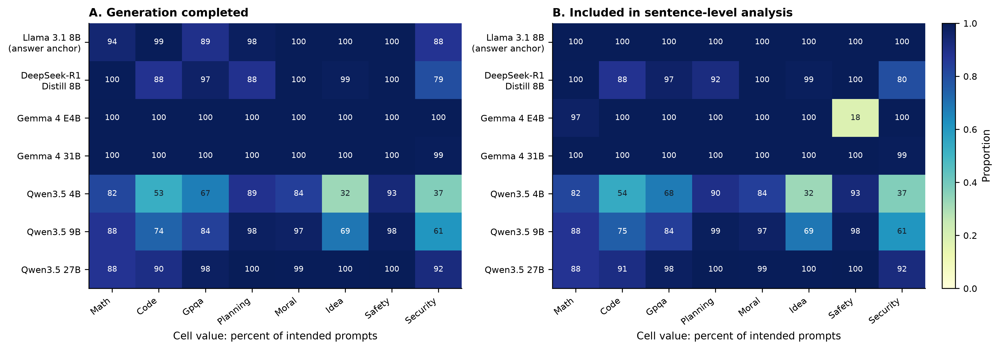
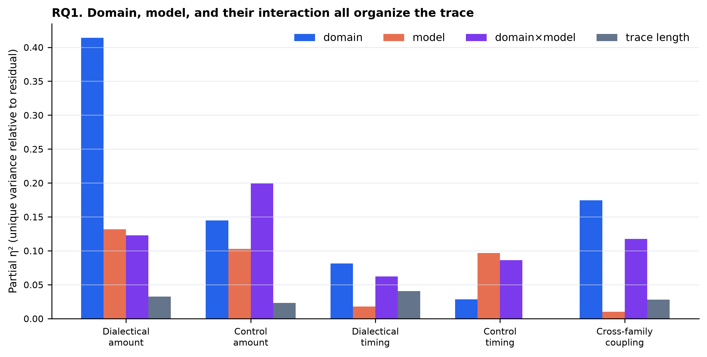
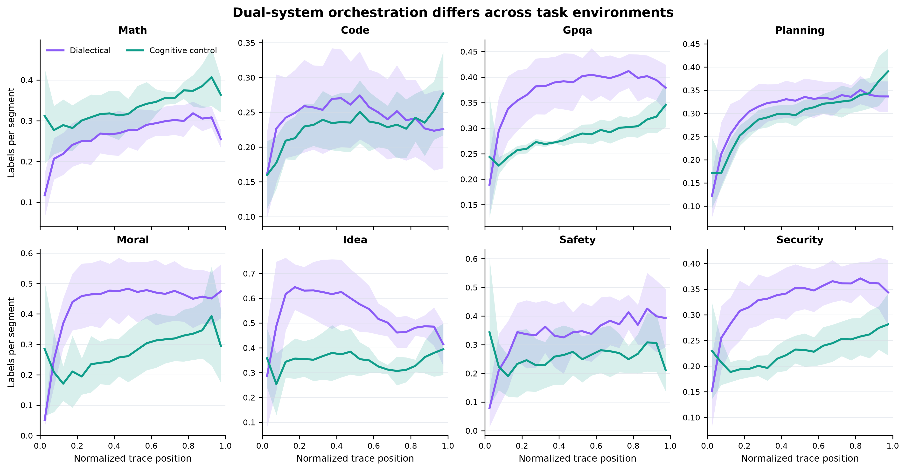
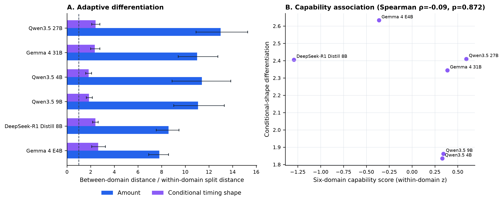
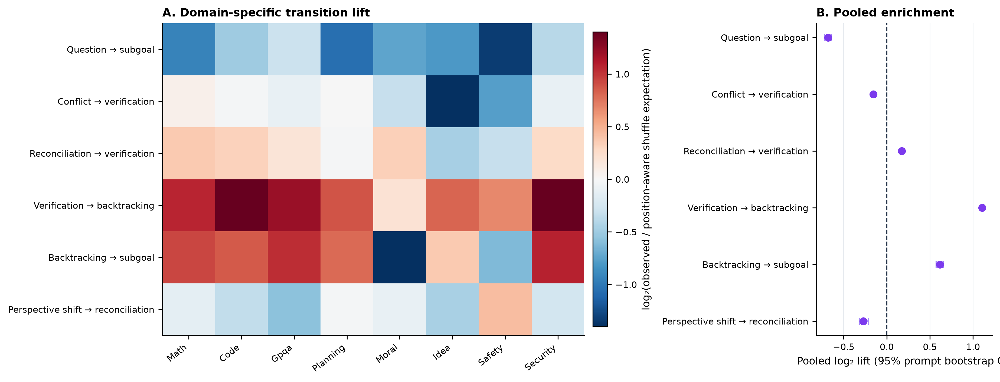
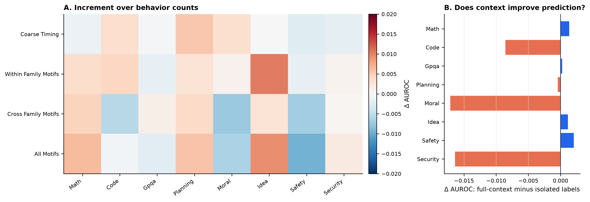
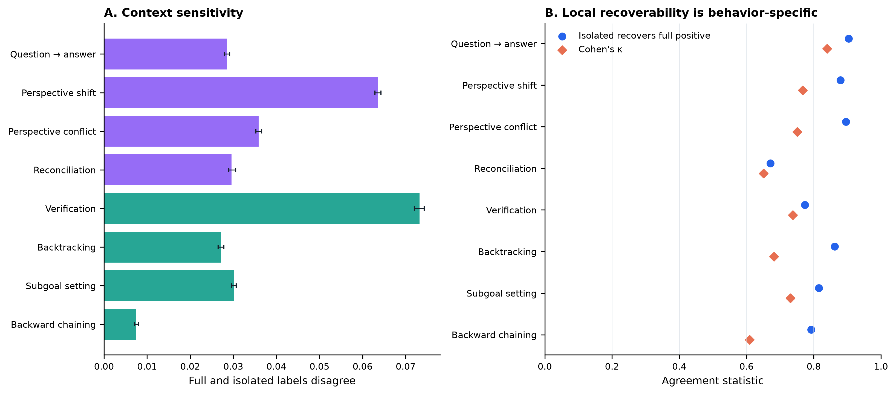
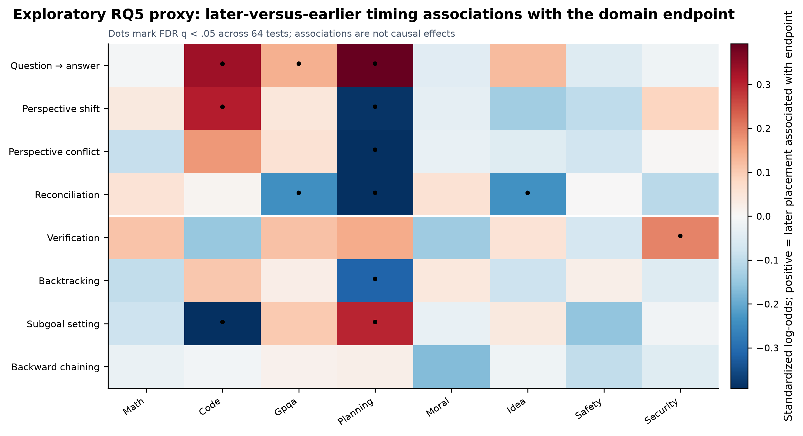

# Thought Atlas: interim analysis report aligned to the execution specification

**Analysis date:** August 9, 2026  
**Data release:** `data/v2`  
**Recommended paper title:** *Thought Atlas: Task-Conditioned Organization of Visible Deliberation Across Models*  
**Scope:** observational analysis of visible text traces; no claim about hidden cognition or causal effects  
**Specification status:** **partially covered, not complete** — see the [browser-readable coverage audit](SPEC_COVERAGE.html) or [`SPEC_COVERAGE.md`](SPEC_COVERAGE.md)

## Executive answer

The completed interim analyses support a narrower descriptive claim:

> **The labels grouped as dialectical and executive-control operations have domain- and model-dependent amounts, temporal profiles, and coupling patterns.**

The evidence is strongest for **behavior amount**, **domain-specific temporal profiles**, and **domain-specific cross-family coupling**. The evidence is weaker for the more ambitious claim that better models are more adaptively differentiated. It is also weak for a universal outcome-predictive motif story: motifs are clearly present in the sequences, but they add almost nothing to prompt-held-out outcome prediction beyond behavior counts.

The paired full-context and isolated labels produce a useful measurement result. Context changes labels in a behavior-specific way, especially for verification, perspective shifts, and reconciliation. However, full-context labels do not improve outcome prediction over isolated labels in the present setup. This is an informative boundary result, not a monitoring success claim.

The current results establish that:

1. Domains alter the summaries of the two theory-defined label groups, their timing, and their coupling.
2. Every tested reasoning model differentiates across domains more than expected from the implemented within-domain prompt split procedure.
3. This differentiation is not monotonically related to capability in the six available reasoning-model conditions.
4. Some transition motifs are strongly enriched, but their relationship with outcomes is domain-specific and their added predictive value is negligible.
5. Local and contextual labels are not interchangeable, yet contextual labeling is not automatically more useful for outcome prediction.

The mandatory empirical test that the 4+4 grouping forms two distinguishable systems was **not run**, including the required `SOT_CORE` versus questioning-only sensitivity. The exact Society-of-Thought/executive nested outcome ladder and transfer tests were also not run. The present package therefore matches the specification's **moderate, provisional outcome**, not its strongest paper framing. It is not submission-complete and is not evidence for an ICLR-style causal or mechanistic claim.

## The RQs and what the data says

| Specification RQ | Status in this package | Current answer |
|---|---|---|
| **RQ1. Are dialectical and executive-control operations empirically distinguishable?** | **Missing** | The theory-defined groups were summarized separately, but profile separation, balanced-partition tests, stratified co-occurrence, and the mandatory `SOT_CORE`/questioning sensitivity were not run. The two-system construct is not yet empirically validated. |
| **RQ2. How do domain and model alter amount, timing, and coupling?** | **Partially covered** | Domain is a major organizer, especially for dialectical amount. Model and domain×model effects are also substantial. Scale effects are family-specific, not universal. Required completion/budget/IPW and formal shape-distance sensitivities remain missing. |
| **RQ3. Are Society-of-Thought behaviors sufficient, or useful through executive coupling?** | **Mostly missing** | Counts were compared with timing/motif blocks, but the required dialectical-only, executive-only, additive, timing, coupling, and motif ladder was not run. Continuous open-ended outcomes and transfer are missing. |
| **RQ4. Do cross-family motifs distinguish outcomes and generalize?** | **Partially covered** | Six adjacent motifs show non-random structure, but the prescribed motif set, lag-2/length-3 features, both permutation nulls, and domain/model-family transfer were not run. |
| **RQ5. Which operations require full trajectory context?** | **Partially covered** | Context sensitivity is behavior-specific. Reconciliation is poorly recovered locally; verification has the highest raw disagreement. Required stratification, disagreement modeling, and external validation are missing. |
| **RQ6. Is capability associated with adaptive differentiation?** | **Partially covered** | All models differentiate across domains under the interim metric, but conditional timing-shape differentiation is unrelated to the six-domain capability score. The required family-specific JS analysis and outcome-prototype alignment are missing. |
| **Exploratory RQ7. K-line-inspired coalition reinstatement?** | **Not run** | Correctly deferred; it must remain future work until RQ1–RQ6 and the robustness contract are complete. |

## Data used and why the analysis population matters

The release contains 24,416 generated traces: seven conditions applied to the same 3,488 prompt instances across eight domains. The two Track-B tables each contain 4,635,520 segment rows. Of these, 4,634,869 paired segment positions were successfully parsed for both label families in both full and isolated context.

Track-B contains 22,111 traces, but coverage is not uniform:

- Qwen3.5-4B completes 66.9% of intended generations and has Track-B labels for 67.3%.
- Qwen3.5-9B completes 83.6% and has Track-B labels for 83.9%.
- Gemma-4-E4B completes all intended generations, but only 18% of its safety traces have Track-B labels.
- The Llama anchor has labels for nearly every answer even when generation is marked incomplete, because it is judged on answer text rather than a reasoning block.

This is why the coverage figure is part of the results package rather than a hidden preprocessing detail. The Qwen scale comparisons are matched on prompts available in both conditions, but they remain selected comparisons. Missing trace labels cannot be fully repaired by inverse weighting because the missing behavioral trajectory itself is unobserved and missingness may depend on that trajectory.

The Llama condition is retained in the coverage audit only. It is excluded from the main inferential analyses because its answer-text channel is not comparable to the think-text channel used for the six reasoning-model conditions.

### Required audit status

The specification's strict-v2 command was rerun on August 9. Canonical files and manifests are present, Parquet magic bytes are valid, and there are no duplicate trace keys. The command nevertheless returns `ok: false` because 13 answer extractions are invalid, 1,622 extraction prompts were truncated, and one accepted row fails consumer validation. `DATASET.md` treats these as release exceptions, but the execution specification defines a strict-v2 failure as a stop condition. This policy discrepancy must be resolved before the staged analysis can be called specification-complete.



## Specification RQ1 — Family separability is not yet tested

The interim package assumes the theory-defined dialectical/executive grouping for summaries. It does **not** run the specification's empirical validation:

- standardized behavior-profile similarities;
- within-family minus cross-family separation;
- prompt-cluster bootstrap;
- exact balanced 4+4 partition comparison;
- stratified same-segment co-occurrence;
- `SOT_ALL` versus three-label `SOT_CORE` versus questioning-only sensitivity.

Therefore, statements below refer to differences between **predefined label groups**. They should not be read as evidence that the eight labels form two recovered latent systems. This is the highest-priority missing scientific analysis.

## Specification RQ2 (partial) — Domain and model organization

### Rationale

If the atlas only reflects model writing style or trace length, it is not a compelling cross-domain contribution. The first analysis therefore separates:

- **amount:** mean number of labels per segment;
- **conditional timing:** the average normalized position of a label, given that it occurs;
- **coupling:** the rate at which both families occur in the same segment beyond the rate expected from their separate marginal prevalence.

The model is fit at the trace level over the six think-text conditions. It includes domain, model, domain×model, and log trace length. Partial η² is reported because the dataset is large enough to make tiny effects statistically significant.

### Main result

Domain is the largest measured organizer of dialectical amount:

| Trace property | Domain partial η² | Model partial η² | Domain×model partial η² | Trace-length partial η² |
|---|---:|---:|---:|---:|
| Dialectical amount | **.414** | .132 | .123 | .033 |
| Cognitive-control amount | .145 | .103 | **.199** | .023 |
| Dialectical timing | **.081** | .018 | .062 | .041 |
| Cognitive-control timing | .029 | **.097** | .086 | <.001 |
| Cross-family coupling | **.175** | .010 | .117 | .028 |

The important nuance is that the two systems behave differently. Dialectical amount is strongly domain-conditioned. Cognitive-control amount is more model-specific in how it responds to domains: its domain×model effect is larger than either the domain or model main effect. Coupling is primarily domain-conditioned rather than a stable model signature.



### What the domain profiles look like

Across model-balanced cell means:

- Ideation has the highest dialectical amount, **0.531 labels per segment**, and the highest cross-family coupling excess, **0.101**.
- Moral reasoning is also dialectically heavy: **0.425 dialectical** versus **0.279 control labels per segment**.
- Math is control-heavy: **0.338 control** versus **0.258 dialectical labels per segment**.
- Planning is balanced on average: **0.308 dialectical** and **0.296 control**.
- Code is also relatively balanced but lower-density: **0.244 dialectical** and **0.231 control**.

The temporal atlas shows more than level differences. Ideation's dialectical activity rises quickly and then falls, whereas math's cognitive-control activity grows toward the end. Planning begins dialectically and ends with stronger cognitive control. These curves are descriptive averages over six model cells, with uncertainty across model-cell means.



### Scale does not have one universal effect

Matched-prompt comparisons point in different directions across model families.

For Qwen3.5-27B versus Qwen3.5-4B on 2,296 shared labeled prompts:

- dialectical amount is lower by **0.0297 labels per segment**, 95% bootstrap CI [−0.0340, −0.0253];
- control amount is higher by **0.0048**, CI [0.0016, 0.0085];
- dialectical and control centroids occur slightly later by **0.0074** and **0.0164** of normalized trace length.

For Gemma-4-31B versus Gemma-4-E4B on 3,212 shared labeled prompts:

- dialectical amount is higher by **0.1160**, CI [0.1092, 0.1219];
- control amount is lower by **0.0598**, CI [−0.0669, −0.0533];
- the timing changes are also much larger than within Qwen.

These opposing patterns rule out a simple claim that scale universally increases one family or preserves one common organization.

### Rare backward chaining was retained

Backward chaining was analyzed with a hurdle summary rather than removed. It appears in **18.6%** of reasoning-model traces overall, but this varies sharply by domain: the across-model occurrence mean is **42.0% in GPQA**, **35.0% in planning**, **25.0% in security**, and below **2% in moral, idea, and safety**. Among traces where it occurs, its mean segment rate is 0.024. This domain dependence is exactly why a global omission would be misleading.

### RQ2 conclusion

The data supports a paper claim about **task-conditioned organization**, not a universal reasoning heartbeat and not a universal scaling law.

## Specification RQ6 (partial) — Adaptive differentiation

### Rationale

A high-variance model is not necessarily adaptive; it may simply be unstable. Adaptive differentiation compares:

1. the distance between a model's average profiles in different domains; and
2. the distance between repeated random prompt halves within the same domain.

A ratio above one means domain differences are larger than prompt-composition variation. Amount profiles use all eight behavior rates after behavior-wise scaling. Shape profiles normalize the binned family trajectory within each trace, separating conditional timing from total amount. Each estimate uses 200 repeated split-halves and 500 bootstrap resamples of the resulting distance distributions.

### Main result

Every model has a ratio clearly above one:

| Model | Amount differentiation | Conditional-shape differentiation |
|---|---:|---:|
| Gemma-4-E4B | 7.81 [6.91, 8.59] | 2.63 [2.09, 3.24] |
| Gemma-4-31B | 11.00 [9.40, 12.75] | 2.34 [1.99, 2.78] |
| Qwen3.5-4B | 11.40 [8.89, 13.85] | 1.84 [1.58, 2.07] |
| Qwen3.5-9B | 11.08 [9.03, 13.31] | 1.86 [1.63, 2.14] |
| Qwen3.5-27B | 12.99 [10.91, 15.28] | 2.41 [2.09, 2.78] |
| DeepSeek-R1-Distill-8B | 8.59 [7.55, 9.47] | 2.41 [2.17, 2.64] |

This means task differentiation is stable enough to rise above within-domain prompt composition noise. It does **not** mean larger ratios are automatically better.

The six-domain capability score has a positive but non-significant association with amount differentiation, Spearman ρ=.71, p=.111. Conditional-shape differentiation has no association with capability, ρ=−.09, p=.872. With only six reasoning-model conditions and severe completion selection for smaller Qwen models, the stronger hypothesis—better models adapt their timing more—does not receive support.



### RQ6 conclusion

The result supports **stable domain differentiation across all tested reasoning models**. It does not support treating differentiation itself as a capability measure.

## Specification RQ4 (partial) — Transition motifs and outcomes

### Rationale

If deliberation is coordinated, the order of operations may matter more than raw counts. Six theory-motivated adjacent transitions were tested. Their observed frequency was compared with an analytic within-trace expectation that preserves each label's count within early, middle, and late thirds of the trace. Confidence intervals use 500 prompt-cluster bootstrap samples.

This is an exploratory precursor to the specification's motif analysis. It omits several prescribed motifs, lag-2 and length-3 events, the independent circular-shift null, the decile-constrained 1,000-permutation null, and leave-one-domain/model-family transfer. Its enrichment estimates are not the specification's confirmatory motif test.

### Sequence structure is real but selective

Three motifs occur more often than the position-aware shuffle expectation:

- verification → backtracking: **2.152×**, CI [2.119, 2.187];
- backtracking → subgoal: **1.531×**, CI [1.487, 1.573];
- reconciliation → verification: **1.128×**, CI [1.113, 1.142].

Three proposed motifs occur less often than expected:

- conflict → verification: **0.897×**, CI [0.883, 0.911];
- perspective shift → reconciliation: **0.829×**, CI [0.801, 0.864];
- question → subgoal: **0.624×**, CI [0.606, 0.642].

The transition heatmap shows strong domain differences. For example, backtracking → subgoal is enriched in math, code, GPQA, planning, and security, but depleted in moral, idea, and safety tasks.



### Outcome associations are domain-specific

The domain models control for the source and destination behavior rates, model identity, and trace length, with standard errors clustered by shared prompt. Eight domain-specific motif results survive FDR across 40 tests. Examples include:

- executive → dialectical transitions in GPQA: OR **1.63** per SD;
- conflict → verification in code: OR **2.07**;
- executive → dialectical transitions in planning: OR **1.50**;
- reconciliation → verification in math: OR **1.18**;
- question → subgoal in code: OR **0.76**;
- dialectical → executive transitions in ideation: OR **0.72**.

The security endpoint is WMDP-Cyber correctness. A positive association there means hazardous-knowledge capability, not safer behavior.

No cross-family motif survives correction in the random-effects meta-analysis across all eight domains. The most promising aggregate, executive → dialectical, has OR 1.23 [1.03, 1.46] before meta-level correction, but q=.117 and high heterogeneity, I²=.79. It should be described as a domain-varying candidate, not a universal beneficial motif.

### Motifs add almost no held-out prediction

Five-fold prediction splits are disjoint by prompt instance, so responses to the same prompt across models never appear in both train and test. Model identity and trace length form the baseline; behavior counts, coarse timing, within-family motifs, and cross-family motifs are added in nested blocks.

Across domains, mean AUROC change relative to the behavior-count model is:

- coarse timing: **+0.0008**;
- within-family motifs: **+0.0024**;
- cross-family motifs: **−0.0009**;
- all motifs: **+0.0006**.

The largest positive motif increment is about +.010 in ideation. The all-motif block reduces safety AUROC by about .010. These changes are too small and inconsistent to support a generic motif-prediction contribution.



### RQ4 conclusion

The sequences have non-random motif structure, and several motifs have domain-specific outcome associations. The data does **not** support the stronger claim that cross-family motifs are universal success primitives or important generic predictors.

## Specification RQ3 — The required complementarity test is missing

The prompt-disjoint prediction analysis above starts with all eight behavior counts and then adds timing or motifs. It does not separately compare:

- metadata only;
- dialectical amount only;
- executive amount only;
- both families;
- family timing;
- cross-family coupling;
- pre-specified motifs.

It also does not report `ΔExecutive|Dialectical`, `ΔDialectical|Executive`, continuous moral/idea/safety metrics, paired bootstrap intervals for model differences, or held-out model-family transfer. Consequently, the near-zero motif increment cannot answer whether Society-of-Thought behavior is sufficient or whether executive features add complementary information. Specification RQ3 remains open.

## Specification RQ5 (partial) — Contextual monitorability

### Rationale

Every segment is labeled by the same judge both in isolation and in the full trace. Because neither view is independent ground truth, this analysis measures **context sensitivity**, not a validity gap. Useful quantities are:

- disagreement between the two labels;
- local recoverability: how often an isolated positive recovers a full-context positive;
- Cohen's κ;
- whether full-context features predict outcomes better.

### Main result

| Behavior | Full/isolated disagreement | Local recoverability | Cohen's κ |
|---|---:|---:|---:|
| Question → answer | 2.9% | 90.4% | .840 |
| Perspective shift | 6.4% | 88.0% | .767 |
| Perspective conflict | 3.6% | 89.6% | .751 |
| Reconciliation | 3.0% | **67.1%** | .651 |
| Verification | **7.3%** | 77.4% | .737 |
| Backtracking | 2.7% | 86.3% | .682 |
| Subgoal setting | 3.0% | 81.5% | .730 |
| Backward chaining | 0.7% | 79.2% | .610 |

Verification has the highest raw context sensitivity. Reconciliation stands out differently: overall disagreement is modest, but only 67.1% of full-context positives are recovered locally. Backward chaining has the lowest κ, partly because it is rare.

At the family-micro level, dialectical disagreement is 3.94% and control disagreement is 3.45%. Local recoverability is 86.3% for dialectical labels and 79.5% for control labels. This is not the clean family split originally anticipated: some control operations, especially verification, also depend strongly on context.



### Context changes labels but does not improve endpoint prediction

With the all-motif feature block, full-context labels average **0.0047 AUROC lower** than isolated labels across the eight domains. The difference is close to zero in most domains, but isolated features do better in code, moral, and security. Therefore:

> Full context changes the operational annotation, but the current endpoint-prediction test does not show that those changes are more useful.

This may mean that the added distinctions matter for construct interpretation but not for the coarse endpoints; it may also reflect systematic judge behavior. Human validation is required before deciding which context is more accurate.

### RQ5 conclusion

Local step labeling is an approximation whose quality varies by operation. The paired design is scientifically valuable, but it does not currently justify the claim that context-aware labels improve process monitoring.

## Exploratory timing analysis — supports RQ2/RQ4; not specification RQ5

### Rationale

The dataset is observational, so it cannot answer whether inserting an operation early or late would cause better performance. It can answer a narrower question: after controlling for the total amount of a behavior, model identity, and trace length, is later-versus-earlier placement associated with the domain endpoint?

Sixty-four domain×behavior associations were tested with prompt-clustered standard errors and FDR correction. Thirteen survive q<.05.

### Strongest associations

Planning has the clearest temporal pattern:

- later conflict: OR **0.65**;
- later reconciliation: OR **0.63**;
- later perspective shifting: OR **0.68**;
- later backtracking: OR **0.73**;
- later question/answering: OR **1.48**;
- later subgoal setting: OR **1.35**.

Other surviving results include:

- code: later subgoals OR **0.64**, later perspective shifts OR **1.36**, later question/answering OR **1.40**;
- GPQA: later reconciliation OR **0.79**, later question/answering OR **1.15**;
- ideation: later reconciliation OR **0.79**;
- security: later verification OR **1.21**.



### Timing-analysis conclusion

Timing associations are heterogeneous enough to motivate a behavior×time×domain intervention. They do not show that moving a behavior would improve or damage a response. A causal paper would need to induce the same operation at matched trace states and randomize early, middle, and late interventions within domains.

## Exploratory RQ7 — K-line-inspired coalition reinstatement was not run

No coalition-window, successful-prototype, reinstatement, or K-line null analysis was implemented. This was optional in the specification and should remain discussion/future work. The current data do not demonstrate K-lines, memory formation, retrieval, or internal agencies.

## What is supported, and what is not

### Supported by the implemented interim estimands

- Domain strongly organizes the amount of dialectical activity.
- Cognitive-control amount depends heavily on the domain×model combination.
- Cross-family coupling differs across domains.
- All six reasoning-model conditions have domain profiles more distinct than within-domain prompt splits.
- Several adjacent transitions are enriched beyond a position-aware within-trace null.
- Motif–outcome relationships and timing associations are domain-specific.
- Full and isolated labels are not interchangeable, especially for reconciliation and verification.
- Coarse timing and simple motifs add little generic predictive value beyond behavior counts.

These statements have not yet passed the specification's full completion, budget, label-source, lexical-cue, outcome, and transfer robustness suite.

### Not supported

- A universal scale law for visible-deliberation organization.
- A monotonic relationship between capability and conditional timing differentiation.
- A domain-general beneficial cross-family motif after multiple-testing correction.
- A generic prediction contribution from motifs or coarse timing.
- Better outcome prediction from full-context labels.
- A causal claim about early or late operations.
- Claims that visible labels directly reveal hidden cognition, inner agents, or faithful internal reasoning.

### Not yet tested under the specification

- Empirical separability of the two families.
- Whether the result survives removing `Question_and_Answering` from Society-of-Thought behavior.
- Incremental executive value after dialectical features, and the reverse contrast.
- Continuous moral, idea, and safety primary outcome models.
- Motif generalization to held-out domains or model families.
- Family-specific adaptive differentiation and successful-prototype outcome alignment.
- Completion-only, 4,096-token, inverse-probability, and lexical-cue robustness.

## Recommended paper framing

Until RQ1 and the robustness/transfer analyses are run, use the specification's moderate framing:

> **Thought Atlas reveals domain- and lineage-specific organizations of visible deliberation and identifies operations whose classification changes with trajectory context.**

A strong introduction can motivate a search for domain-conditioned organization, then let the negative results refine the theory:

- domain adaptation is real;
- adaptation is not automatically capability;
- non-random sequence structure is real;
- sequence structure is not automatically a universal success signal;
- context changes measurement;
- context is not automatically more predictive.

Do not yet use the strongest claim that successful traces are distinguished by cross-family orchestration. Family separability is untested, coupling/motif prediction is weak, and transfer is missing. A revisionary or moderate paper can still be credible once the measurement and robustness phases are complete.

## Figure placement guide

| Figure | Main takeaway | Suggested placement |
|---|---|---|
| **Fig. 1 — Coverage and selection** | Qwen completion and Gemma-E4B safety label coverage create real selection risks. | Methods or limitations; must be visible, not hidden. |
| **Fig. 2 — Predefined-family atlas** | The theory-defined groups have visibly different domain trajectories; this is not a family-validity test. | Interim main text; retain after RQ1 validation. |
| **Fig. 3 — Variance partition** | Domain and domain×model effects are substantively large. | Main text, central inferential figure. |
| **Fig. 4 — Interim adaptive differentiation** | All models differentiate under the interim RMSE metric; capability does not track combined timing differentiation. | Appendix until family-specific JS analysis is complete. |
| **Fig. 5 — Exploratory motif enrichment** | Some adjacent transitions are enriched under the analytic thirds-based expectation. | Appendix until the prescribed motifs/nulls/transfer tests are complete. |
| **Fig. 6 — Context monitorability** | Context dependence is behavior-specific. | Main text, paired-measurement contribution. |
| **Fig. 7 — Predictive value** | Timing/motifs and full context add little generic AUROC. | Main text boundary result or appendix. |
| **Fig. 8 — Timing associations** | Timing–outcome relationships are domain-specific but observational. | Appendix or causal-follow-up motivation. |

Every figure is supplied as a 300-dpi PNG and a vector PDF in `figures/`.

The specification still requires a conceptual two-family figure, a dedicated amount-versus-shape comparison, an exact nested outcome-increment figure, a held-out motif network, and a consolidated robustness panel.

## Statistical and reproducibility notes

- **Amount:** mean count of the four family labels per valid segment. Because labels are multi-label, the range is 0–4 rather than 0–1.
- **Specification difference:** the specification's `family_label_density` divides this value by four. Current values are therefore labels-per-segment summaries, not the canonical 0–1 density.
- **Conditional timing:** label-weighted normalized trace position, conditional on occurrence.
- **Coupling excess:** observed same-segment co-presence of the two families minus the product of their marginal presence rates.
- **Trajectory curves:** 20 normalized-position bins, averaged per trace, then model-balanced within each domain.
- **Variance partition:** trace-level OLS with domain×model and log segment count; Type-II partial η². Treat these as effect-size decompositions, not causal variance components.
- **Adaptive differentiation:** between-domain profile RMSE divided by repeated within-domain split-half RMSE.
- **Specification difference:** adaptive differentiation combines all eight amount features and both family-shape curves; it is not the required dialectical/SOT-core/executive Jensen–Shannon analysis.
- **Motif null:** expected adjacent transitions under independent label placement within each trace third, preserving per-trace/per-third label counts in expectation.
- **Specification difference:** this is not either prescribed 1,000-permutation null (independent circular shifts or temporal-decile shuffles).
- **Motif confidence intervals:** 500 bootstrap resamples of shared prompt clusters.
- **Outcome models:** domain-specific logistic regressions with model and log length controls; prompt-clustered standard errors; marginal source/destination rates included for focal motif tests.
- **Prediction:** five prompt-disjoint folds; ridge logistic models; model identity and trace length included in every block.
- **Multiple tests:** Benjamini–Hochberg FDR.
- **Open-ended outcomes:** at-or-above model/domain median quality, matching the repository monitor. Ideation scores are discrete and tied at the median, so its positive prevalence is 70.6%; continuous-quality sensitivity analysis should be added before submission.
- **Safety outcome:** absence of high harmful compliance; prevalence is 93.5%, so AUROC should be accompanied by AUPRC and calibration in a full paper.
- **Security outcome:** WMDP-Cyber correctness is hazardous-knowledge capability, not a safety benefit.

Reproduce the package from the repository root:

```bash
MPLCONFIGDIR="$PWD/.tmp-paper-analysis/mpl" \
  .venv/bin/python scripts/paper_rq_results.py \
  --bootstrap 500 \
  --splits 200 \
  --out-dir paper_results
```

`manifest.json` records the interim seed, input hashes, generated tables, and figure files. The run uses 500 bootstrap resamples and 200 split-half repetitions; the specification requires at least 1,000 bootstrap/permutation replicates for final headline results.

## Required work before specification-complete reporting

The interim package can support drafting and method development, but it is not the final statistical package. The prioritized remaining work is:

1. **Resolve the audit gate and build the canonical PR-1 data layer.** Strict-v2 currently returns `ok: false`; the spec requires a reviewed resolution before new modeling. Add the config, lazy loaders, outcome registry, split registry, staged CLI, audit outputs, and paper-specific tests.
2. **Run specification RQ1.** Test profile separation, co-occurrence, exact balanced partitions, and mandatory `SOT_ALL`/`SOT_CORE`/questioning sensitivity.
3. **Run the exact M0–M5 outcome ladder.** Use continuous moral/idea/safety primary outcomes, paired prompt-bootstrap intervals, and held-out model-family evaluation.
4. **Complete the motif grammar.** Add the complete primary motif set, lag-2 and length-3 events, both 1,000-permutation nulls, and domain/model-family transfer.
5. **Complete contextual monitorability.** Add domain/model/phase/outcome stratification, a clustered disagreement model, prevalence-adjusted agreement, and an independent validation sample.
6. **Complete adaptive differentiation.** Report dialectical, SOT-core, and executive JS distances, successful-prototype alignment, and Qwen/Gemma completion robustness.
7. **Run robustness.** Completed-only, fixed-4,096-token, IPW, length-matched, cue-only, continuous/threshold outcome, and multi-seed analyses where feasible.
8. **Add artifact governance.** Finding registry, config/code hashes, exact plotted-value sidecars, required figures, and ≥1,000 final resamples.

A causal timing test is an ICLR upgrade, not a prerequisite for the moderate NAACL analysis. Independent annotation validation and the missing RQ1/robustness work are prerequisites for strong construct claims.

## Package contents

- `REPORT.md`: this report.
- `REPORT.html`: browser-readable version of this report.
- `SPEC_COVERAGE.md` / `SPEC_COVERAGE.html`: scientific and engineering coverage audit against the August 6 execution specification.
- `figures/`: eight figures in PNG and PDF.
- `tables/`: exact tables for the analyses that were run; these do **not** cover every specification RQ.
- `cache/trace_features_full.parquet`: reproducible full-context trace-level feature table.
- `cache/trace_features_isolated.parquet`: matching isolated-context trace-level feature table.
- `manifest.json`: input hashes and run parameters.
